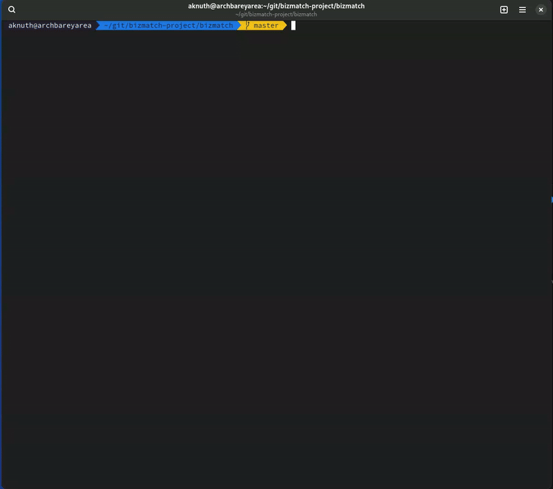

# Interactive Directory Explorer

A powerful terminal-based file explorer with directory navigation, file selection, and content viewing capabilities.



## Features

- **Interactive Tree Navigation**: Browse directory structures with keyboard controls
- **Selection System**: Select files and directories with visual feedback
- **Partial Selection Indicators**: Shows when only some subdirectories are selected
- **Content Viewing**: View text file contents directly in the terminal
- **Save Selections**: Export lists of selected paths
- **Save File Contents**: Export contents of selected files
- **Performance Optimizations**: Efficiently handles large directory structures

## Installation

```bash
# Clone the repository
git clone https://github.com/aknuth/TreeView-Explorer.git
cd TreeView-Explorer

# Install dependencies
npm install
# or if using Bun
bun install
```

## Usage

```bash
# Run with current directory
bun directory-tree-viewer.ts

# Run with specific directory
bun directory-tree-viewer.ts /path/to/directory
```

### Keyboard Controls

#### Directory Navigation

- **↑/↓**: Move up/down
- **Enter**: Expand/collapse directory
- **Space**: Select/deselect item
- **q**: Quit application

#### Actions

- **S**: Save selected paths to a file
- **D**: Display content of selected files on screen
- **F**: Save content of selected files to a file

#### Content Viewer

- **→**: Next file
- **←**: Previous file
- **↓**: Next page
- **↑**: Previous page
- **q**: Return to tree view

## Performance Considerations

The explorer handles large directories efficiently by:

- Deferring the loading of large directory contents until requested
- Dynamically rendering only the visible portion of the tree
- Efficiently tracking selection states

## Configuration

You can customize ignored directories by modifying the `IGNORE_DIRS` constant in the source code:

```typescript
// List of directories to ignore for better performance
const IGNORE_DIRS = ["node_modules", ".git", "dist", "build", ".next", ".cache"];
```

## License

[GPL-3.0](LICENSE)

## Contributing

Contributions are welcome! Please feel free to submit a Pull Request.

1. Fork the repository
2. Create your feature branch (`git checkout -b feature/amazing-feature`)
3. Commit your changes (`git commit -m 'Add some amazing feature'`)
4. Push to the branch (`git push origin feature/amazing-feature`)
5. Open a Pull Request
